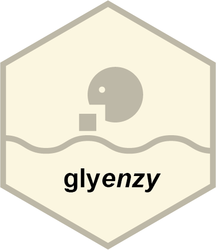

<!-- README.md is generated from README.Rmd. Please edit that file -->

```{r, include = FALSE}
knitr::opts_chunk$set(
  collapse = TRUE,
  comment = "#>",
  fig.path = "man/figures/README-",
  out.width = "100%"
)
```

# glyenzy <a href="https://glycoverse.github.io/glyenzy/"></a>

<!-- badges: start -->
[](https://lifecycle.r-lib.org/articles/stages.html#experimental)
[](https://CRAN.R-project.org/package=glyenzy)
[](https://glycoverse.r-universe.dev/glyenzy)
[](https://github.com/glycoverse/glyenzy/actions/workflows/R-CMD-check.yaml)
[](https://app.codecov.io/gh/glycoverse/glyenzy)
<!-- badges: end -->

The glyenzy package helps simulate the biosynthetic process of glycosylation in silico. 
Key features include: identifying the specific glycosyltransferase responsible for each glycosidic bond; 
reconstructing the biosynthetic pathway of a given glycan; 
exploring possible transformations between two glycan structures via glycosyltransferases and glycosidases; 
and predicting the glycans that can be synthesized from a given substrate structure and a set of enzymes.

## Installation

The glyenzy package is not a core glycoverse package.
You need to install it individually even if you have installed the meta-package [glycoverse](https://github.com/glycoverse/glycoverse).

You can install the latest release of glyenzy from [r-universe](https://glycoverse.r-universe.dev/glyenzy) (**recommended**):

```r
# install.packages("pak")
pak::repo_add(glycoverse = "https://glycoverse.r-universe.dev")
pak::pkg_install("glyenzy")
```

Or from [GitHub](https://github.com/glycoverse/glyenzy):

```r
pak::pkg_install("glycoverse/glyenzy@*release")
```

Or install the development version (NOT recommended):

```r
pak::pkg_install("glycoverse/glyenzy")
```

**Note:** Tips and troubleshooting for the meta-package [glycoverse](https://github.com/glycoverse/glycoverse)
are also applicable here: [Installation of glycoverse](https://github.com/glycoverse/glycoverse#installation).

## Documentation

- 🚀 Get started: [Here](https://glycoverse.github.io/glyenzy/articles/glyenzy.html)
- 📚 Reference: [Here](https://glycoverse.github.io/glyenzy/reference/index.html)

## Role in `glycoverse`

As one of the most downstream components of the `glycoverse` ecosystem,
this package builds on `glyrepr`, `glyparse`, and `glymotif`,
with planned integration with `glydraw`.
It is intended for direct use by omics researchers,
providing practical, analysis-ready insights into glycan biosynthesis.

## Example

```{r}
library(glyrepr)
library(glyenzy)
```

Say we have a glycan...

```{r}
glycan <- "Gal(b1-4)GlcNAc(b1-6)[Gal(b1-3)]GalNAc(a1-"
```

And you want to know what enzymes participates in the biosynthesis of this glycan...

```{r}
get_involved_enzymes(glycan)
```

Here you go!

What if you're curious of what new glycans can by generated by applying ST3GAL1?

```{r}
apply_enzyme(glycan, "ST3GAL1")
```
