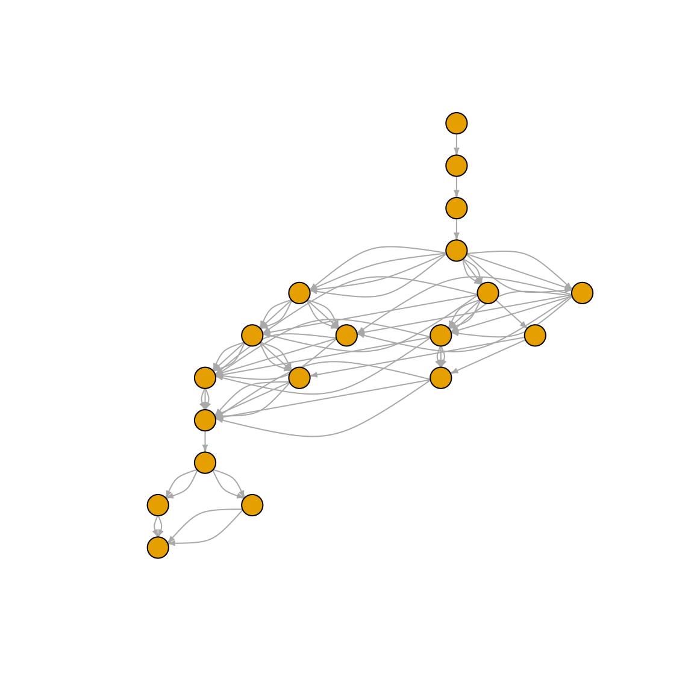

# Get Started with glyenzy

Think of glycan biosynthesis as nature’s most sophisticated assembly
line 🏭. Glycosyltransferases work like specialized robots, each with a
very particular job: some love attaching GlcNAc residues, others are
obsessed with Gal, and each follows strict rules about where and how to
make connections. It’s like LEGO building!

While you might build a LEGO house solo on a weekend, cells need an
entire crew of enzymatic specialists working in perfect coordination.
The result? Thousands of unique glycan structures, each crafted with
precision.

Enter `glyenzy` 🧬 – your computational toolkit for exploring this
fascinating world. Whether you want to trace how a glycan came to be or
predict what new structures might emerge from a biochemical reaction,
glyenzy has you covered.

``` r
library(glyrepr)
library(glyenzy)
library(igraph)
#> 
#> Attaching package: 'igraph'
#> The following objects are masked from 'package:stats':
#> 
#>     decompose, spectrum
#> The following object is masked from 'package:base':
#> 
#>     union
```

**Quick heads-up:** `glyenzy` stands on the shoulders of giants –
specifically `glyrepr`, `glyparse`, and `glymotif`. You don’t need to
master these packages to get started, but they’re worth exploring for
advanced glycan wizardry ✨. Also, this vignette assumes you’re
comfortable with IUPAC-condensed notation. New to it? No worries – check
out [this friendly
tutorial](https://glycoverse.github.io/glyrepr/articles/iupac.html)
first!

## Your First Taste of Glycan Engineering 🚀

Let’s dive right in with a hands-on example! We’ll start with a charming
O-glycan that’s perfect for demonstration:


Notice how each glycosidic bond is labeled with its responsible enzyme?
That’s the beauty of glycan biosynthesis – every connection has a story!
(We’ll skip the rightmost peptide bond for now.)

Here’s our star glycan in IUPAC-condensed notation:

``` r
glycan <- "Gal(b1-4)GlcNAc(b1-6)[Gal(b1-3)]GalNAc(a1-"
```

Time to meet your new best friend:
[`get_involved_enzymes()`](https://glycoverse.github.io/glyenzy/reference/get_involved_enzymes.md)
👋 This clever function reveals all the enzymes that might have had a
hand in building your glycan:

``` r
get_involved_enzymes(glycan)
#>  [1] "B4GALT1" "B4GALT2" "B4GALT3" "B4GALT4" "B4GALT5" "B4GALT6" "C1GALT1"
#>  [8] "GCNT1"   "GCNT3"   "GCNT4"
```

Cool, right? Not only does it spot the enzymes from our diagram, but it
also whispers about B4GALT1/2/3/4 potentially being involved. (Don’t
worry, we’ll unpack this mystery soon!)

But wait, there’s more! What if we want to see what happens when we add
a new enzyme to the mix? Let’s give ST3GAL1 a chance to work its magic:

``` r
apply_enzyme(glycan, "ST3GAL1")
#> <glycan_structure[1]>
#> [1] Neu5Ac(a2-3)Gal(b1-3)[Gal(b1-4)GlcNAc(b1-6)]GalNAc(a1-
#> # Unique structures: 1
```

Fascinating! 🎯 The function returns a
[`glyrepr::glycan_structure()`](https://glycoverse.github.io/glyrepr/reference/glycan_structure.html)
vector, but the real story is what happened: a shiny new sialic acid got
attached to the β1-3 Gal, while the β1-4 Gal was completely ignored.
Why? Because ST3GAL1 is incredibly picky – it only recognizes
“Gal(β1-3)GalNAc(α1-” as its substrate.

Getting the hang of it? Great! Let’s explore what else glyenzy can do
for you.

## Detective Work: Tracing Glycan Origins 🔍

Ever wondered about a glycan’s backstory? glyenzy is your molecular
detective, ready to solve three key mysteries:

- **Who did it?** Which glycosyltransferases and glycoside hydrolases
  were involved?
- **How many times?** How often did each enzyme swing into action?
- **What’s the timeline?** In what order did these biochemical events
  unfold?

Behind the scenes, glyenzy has catalogued the reaction rules of 105
enzymes in its molecular database. Want to peek at any enzyme’s profile?
Just use `enzyme("MGAT3")` and prepare to be amazed by the biochemical
details!

Combined with the sophisticated motif-matching algorithms from
`glymotif`, we can reconstruct any glycan’s complete biography.

You’ve already met
[`get_involved_enzymes()`](https://glycoverse.github.io/glyenzy/reference/get_involved_enzymes.md)
– perfect for getting the full cast of characters. But sometimes you
want more targeted intel:

- [`is_synthesized_by()`](https://glycoverse.github.io/glyenzy/reference/is_synthesized_by.md)
  answers “Was enzyme X involved?” with a simple yes/no
- [`count_enzyme_steps()`](https://glycoverse.github.io/glyenzy/reference/count_enzyme_steps.md)
  tells you exactly how many times an enzyme got busy

This intel is gold for multiomics analysis – imagine linking glycan
structures directly to enzyme expression levels! 📊

Ready for the grand finale? Meet
[`rebuild_biosynthesis()`](https://glycoverse.github.io/glyenzy/reference/rebuild_biosynthesis.md)
– the function that reconstructs a glycan’s complete life story:

``` r
path <- rebuild_biosynthesis(glycan)
path
#> IGRAPH 286bd39 DN-- 4 10 -- 
#> + attr: name (v/c), enzyme (e/c), step (e/n)
#> + edges from 286bd39 (vertex names):
#> [1] GalNAc(a1-                       ->Gal(b1-3)GalNAc(a1-                       
#> [2] Gal(b1-3)GalNAc(a1-              ->Gal(b1-3)[GlcNAc(b1-6)]GalNAc(a1-         
#> [3] Gal(b1-3)GalNAc(a1-              ->Gal(b1-3)[GlcNAc(b1-6)]GalNAc(a1-         
#> [4] Gal(b1-3)GalNAc(a1-              ->Gal(b1-3)[GlcNAc(b1-6)]GalNAc(a1-         
#> [5] Gal(b1-3)[GlcNAc(b1-6)]GalNAc(a1-->Gal(b1-4)GlcNAc(b1-6)[Gal(b1-3)]GalNAc(a1-
#> [6] Gal(b1-3)[GlcNAc(b1-6)]GalNAc(a1-->Gal(b1-4)GlcNAc(b1-6)[Gal(b1-3)]GalNAc(a1-
#> [7] Gal(b1-3)[GlcNAc(b1-6)]GalNAc(a1-->Gal(b1-4)GlcNAc(b1-6)[Gal(b1-3)]GalNAc(a1-
#> + ... omitted several edges
```

What you get back is a directed `igraph` object – think of it as a
molecular family tree! 🌳 Each vertex represents a glycan structure, and
each edge represents an enzymatic step. If more than one enzyme is
involved in an enzymatic step, multiple edges are created between the
two vertices.

Let’s try this with a more complex N-glycan:

``` r
glycan <- "GlcNAc(b1-2)Man(a1-3)[Man(a1-6)]Man(b1-4)GlcNAc(b1-4)GlcNAc(b1-"
path <- rebuild_biosynthesis(glycan)
plot(
  path,
  layout = layout_as_tree(path),
  vertex.label = NA,
  vertex.size = 10,
  edge.arrow.size = 0.3,
  margin = 0
)
```



**Note:** The plotting could use some TLC – we’re working on prettier
visualizations! 🎨

## Crystal Ball Mode: Predicting Glycan Futures 🔮

Now for the really fun part – playing molecular fortune teller! glyenzy
can predict what new glycans emerge when you mix specific enzymes with
existing structures. Let’s start simple and work our way up to some
serious biochemical wizardry.

``` r
# The humble GalNAc core of O-glycan
glycan <- "GalNAc(a1-"
```

What happens if we introduce C1GALT1 to this lonely GalNAc?

``` r
apply_enzyme(glycan, "C1GALT1")
#> <glycan_structure[1]>
#> [1] Gal(b1-3)GalNAc(a1-
#> # Unique structures: 1
```

Boom! 💥 We just witnessed the birth of the famous Core 1 O-GalNAc
glycan!

Here’s how
[`apply_enzyme()`](https://glycoverse.github.io/glyenzy/reference/apply_enzyme.md)
works: give it a glycan and an enzyme, and it returns all possible
products. When multiple outcomes are possible, you’ll get them all
bundled in a
[`glyrepr::glycan_structure()`](https://glycoverse.github.io/glyrepr/reference/glycan_structure.html)
vector.

``` r
# A bi-antennary agalactosylated N-glycan (fancy name for "no galactose yet")
glycan <- "GlcNAc(b1-2)Man(a1-3)[GlcNAc(b1-2)Man(a1-6)]Man(b1-4)GlcNAc(b1-4)GlcNAc(b1-"
apply_enzyme(glycan, "B4GALT1")
#> <glycan_structure[2]>
#> [1] Gal(b1-4)GlcNAc(b1-2)Man(a1-3)[GlcNAc(b1-2)Man(a1-6)]Man(b1-4)GlcNAc(b1-4)GlcNAc(b1-
#> [2] Gal(b1-4)GlcNAc(b1-2)Man(a1-6)[GlcNAc(b1-2)Man(a1-3)]Man(b1-4)GlcNAc(b1-4)GlcNAc(b1-
#> # Unique structures: 2
```

Perfect! Both antennae can be galactosylated, giving us two distinct
products. This is biochemical branching in action! 🌿

### The Primordial Soup Experiment 🧪

Ready for some serious fun? Let’s create a molecular primordial soup!
Toss in some glycan substrates, add a cocktail of enzymes, and watch the
magic unfold over multiple reaction steps.

Use
[`spawn_glycans()`](https://glycoverse.github.io/glyenzy/reference/spawn_glycans_step.md)
for the full experience, or
[`spawn_glycans_step()`](https://glycoverse.github.io/glyenzy/reference/spawn_glycans_step.md)
if you prefer to watch the drama unfold step by step:

``` r
# Our trusty bi-antennary N-glycan meets three enzyme friends
spawn_glycans(glycan, c("B4GALT1", "ST3GAL3", "MGAT3"))
#> ⠙ Step 4/5 | ■■■■■■■■■■■■■■■■■■■■■■■■■         80% | current number of glycans:…
#> ⠙ Step 5/5 | ■■■■■■■■■■■■■■■■■■■■■■■■■■■■■■■  100% | current number of glycans:…
#> <glycan_structure[32]>
#> [1] GlcNAc(b1-2)Man(a1-3)[GlcNAc(b1-2)Man(a1-6)]Man(b1-4)GlcNAc(b1-4)GlcNAc(b1-
#> [2] Gal(b1-4)GlcNAc(b1-2)Man(a1-3)[GlcNAc(b1-2)Man(a1-6)]Man(b1-4)GlcNAc(b1-4)GlcNAc(b1-
#> [3] Gal(b1-4)GlcNAc(b1-2)Man(a1-6)[GlcNAc(b1-2)Man(a1-3)]Man(b1-4)GlcNAc(b1-4)GlcNAc(b1-
#> [4] GlcNAc(b1-2)Man(a1-3)[GlcNAc(b1-4)][GlcNAc(b1-2)Man(a1-6)]Man(b1-4)GlcNAc(b1-4)GlcNAc(b1-
#> [5] Gal(b1-4)GlcNAc(b1-2)Man(a1-3)[Gal(b1-4)GlcNAc(b1-2)Man(a1-6)]Man(b1-4)GlcNAc(b1-4)GlcNAc(b1-
#> [6] Gal(b1-4)GlcNAc(b1-2)Man(a1-3)[GlcNAc(b1-4)][GlcNAc(b1-2)Man(a1-6)]Man(b1-4)GlcNAc(b1-4)GlcNAc(b1-
#> [7] GlcNAc(b1-2)Man(a1-3)[Gal(b1-4)GlcNAc(b1-4)][GlcNAc(b1-2)Man(a1-6)]Man(b1-4)GlcNAc(b1-4)GlcNAc(b1-
#> [8] Gal(b1-4)GlcNAc(b1-2)Man(a1-6)[GlcNAc(b1-2)Man(a1-3)][GlcNAc(b1-4)]Man(b1-4)GlcNAc(b1-4)GlcNAc(b1-
#> [9] Neu5Ac(a2-3)Gal(b1-4)GlcNAc(b1-2)Man(a1-3)[GlcNAc(b1-2)Man(a1-6)]Man(b1-4)GlcNAc(b1-4)GlcNAc(b1-
#> [10] Neu5Ac(a2-3)Gal(b1-4)GlcNAc(b1-2)Man(a1-6)[GlcNAc(b1-2)Man(a1-3)]Man(b1-4)GlcNAc(b1-4)GlcNAc(b1-
#> ... (22 more not shown)
#> # Unique structures: 32
```

What a party! 🎉 Here’s what each enzyme brought to the table:

- **B4GALT1**: Adds β1-4 Gal to those lonely GlcNAc branches
- **ST3GAL3**: Decorates with α2-3 sialic acid (the fancy finishing
  touch)
- **MGAT3**: Drops in a bisecting GlcNAc right at the core mannose

The result? A spectacular collection of 32 different glycans, including
our original starting structure!

## The Fine Print: What You Need to Know ⚠️

Before you go wild with glyenzy, here are some important caveats to keep
in mind:

### Species and Scope

glyenzy is currently a human-centric package, focusing specifically on
N-glycans and O-glycans. If you’re working with GAGs, glycolipids, or
glycans from mouse, plants or insects, the results might not be
accurate. We’re basically specialists, not generalists! 🎯

### The “Better Safe Than Sorry” Approach

Our algorithms are intentionally inclusive – they assume that *all*
possible isoenzymes capable of catalyzing a reaction might be involved.
This means you should interpret results with a grain of salt.

For instance, when glyenzy spots the motif “Neu5Ac(α2-3)Gal(β1-”, it’ll
flag both ST3GAL3 and ST3GAL4 as potential culprits. In reality, tissue
specificity and other factors might mean only one is actually active.
Think of it as getting a list of suspects rather than the definitive
perpetrator! 🕵️

### Concrete Residues Only

glyenzy is picky about precision – it only works with **concrete**
residues like “Glc” and “GalNAc”, not **generic** ones like “Hex” or
“HexNAc”. If your data uses generic terms, you’ll need to be more
specific! 🎯

### Substituents: Not Yet Supported

Modifications like sulfation and phosphorylation aren’t supported yet,
and they might actually break the algorithms. If your glycans are
decorated with these extras, use
[`glyrepr::remove_substituents()`](https://glycoverse.github.io/glyrepr/reference/remove_substituents.html)
to get clean, analysis-ready structures.

### Complete Structures Required

Incomplete or partially degraded glycan structures can lead glyenzy
astray. Make sure your input represents the full, intact glycan for
reliable results! ✅

### Where We Start the Story

glyenzy has specific starting points for its biosynthetic narratives:

- **N-glycans**: Begin with the Glc₃Man₉GlcNAc₂ precursor (post-OST
  transfer)
- **O-GalNAc glycans**: Start with GalNAc(α1-
- **O-GlcNAc glycans**: Start with GlcNAc(b1-
- **O-Man glycans**: Start with Man(a1-
- **O-Fuc glycans**: Start with Fuc(a1-
- **O-Glc glycans**: Start with Glc(b1-

This means we don’t track the earlier steps – ALGs building the N-glycan
precursor, OST transferring it to asparagine, or GALNTs adding the
initial GalNAc. We pick up the story from there! 📖

## Behind the Scenes: The Technical Magic ⚙️

Curious about what makes glyenzy tick? Here’s the tech stack:

- **`glyrepr`**: The foundation for representing glycan structures
- **`glyparse`**: The linguistic expert that decodes IUPAC-condensed
  notation
- **`glymotif`**: The pattern-matching wizard that finds structural
  motifs

All enzymes live as
[`enzyme()`](https://glycoverse.github.io/glyenzy/reference/enzyme.md)
objects (technically `glyenzy_enzyme` S3 class instances). Want to peek
under the hood of any enzyme? Just call `enzyme("YOUR_FAVORITE_ENZYME")`
and prepare for a detailed biochemical profile! 🔬
