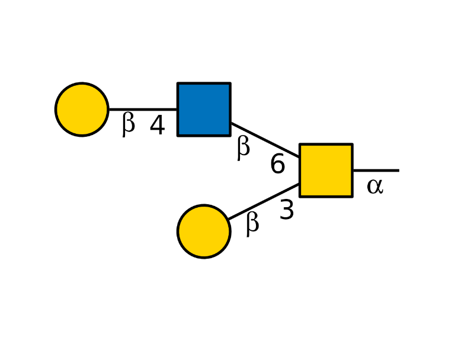
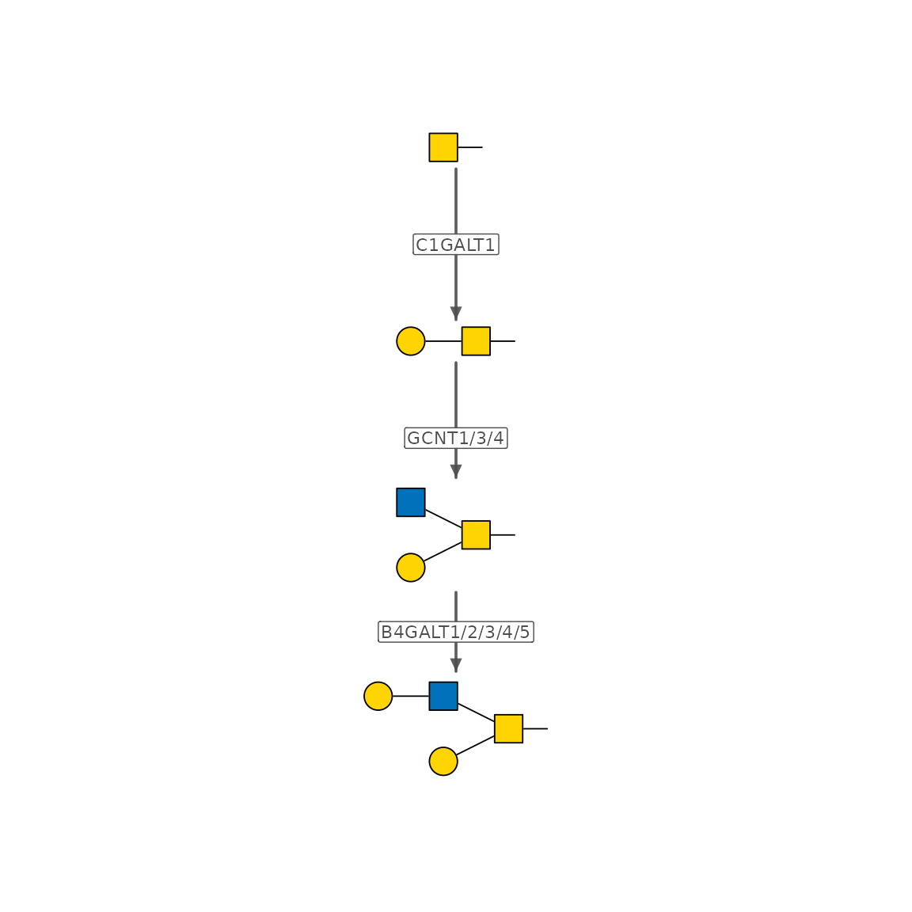
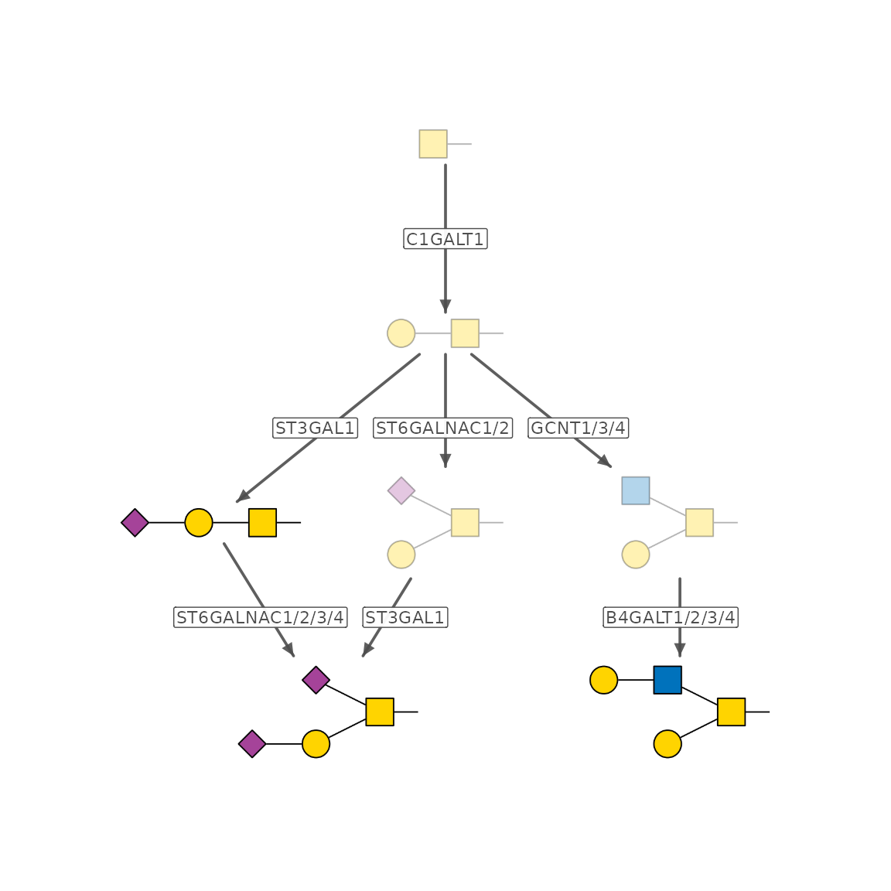
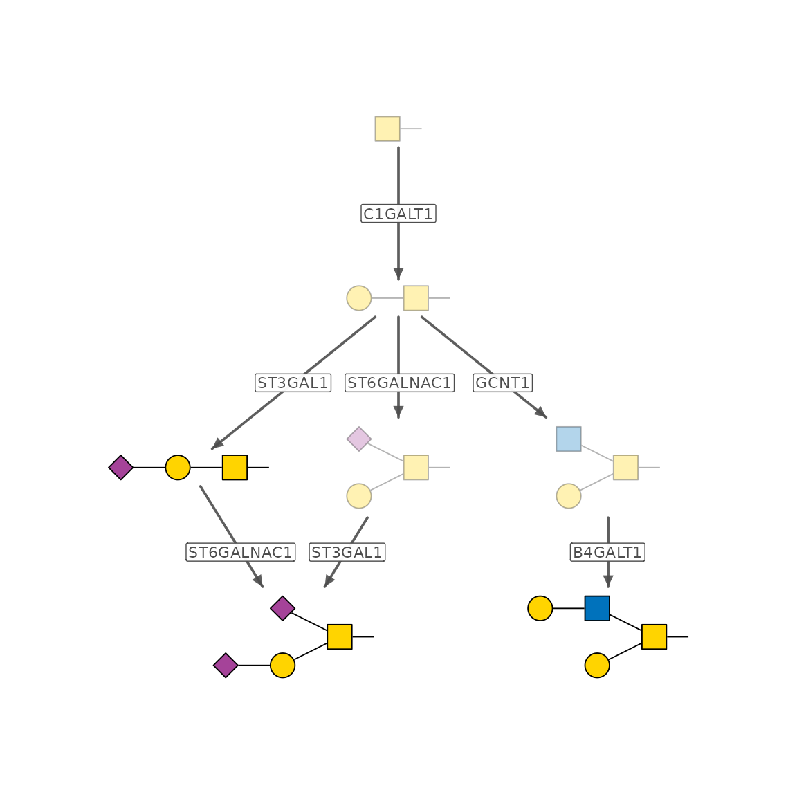
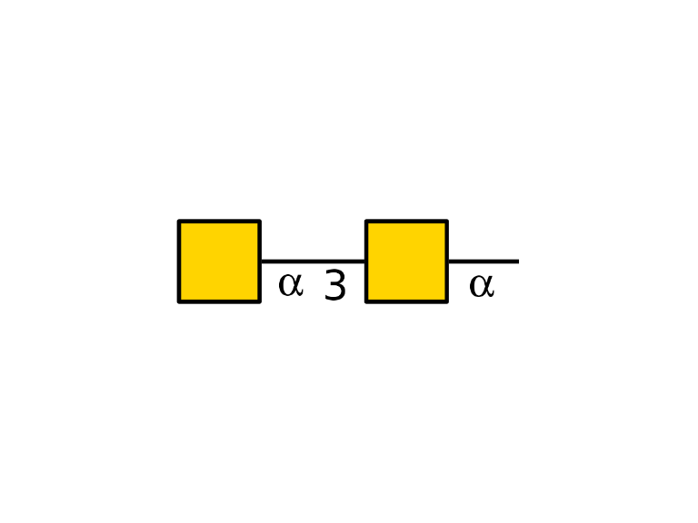
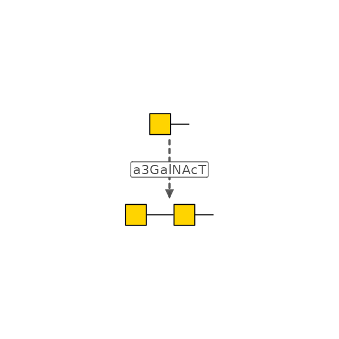
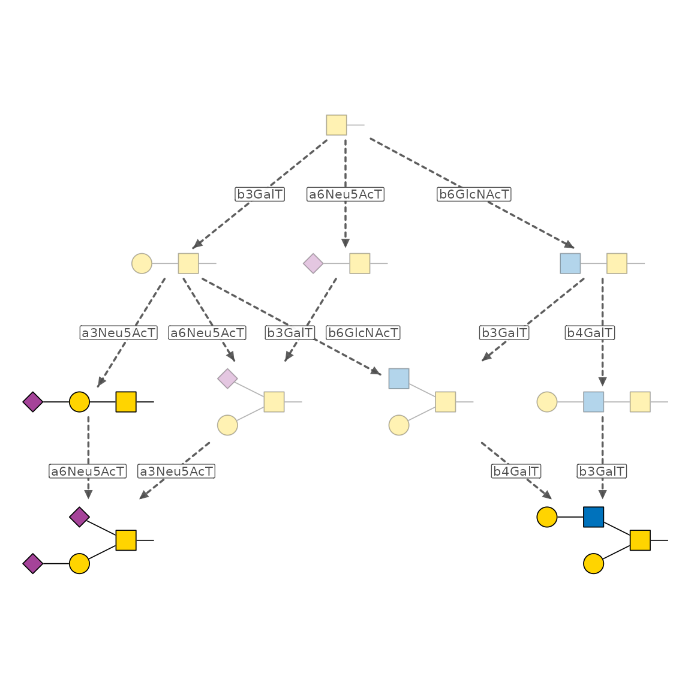
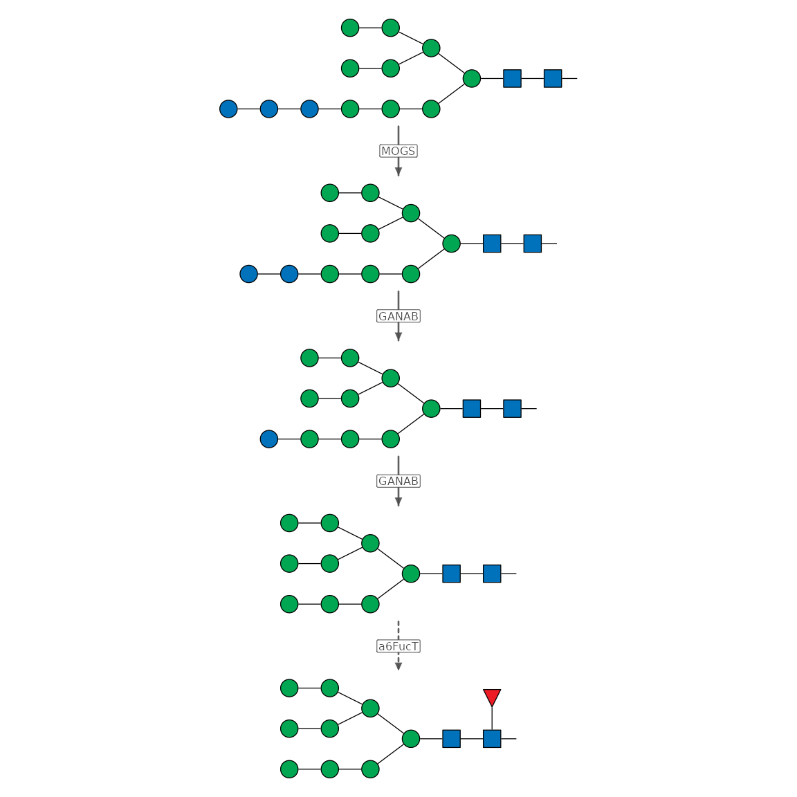

# Glycan Biosynthesis Network

In [Get Started with
glyenzy](https://glycoverse.github.io/glyenzy/articles/glyenzy.html), we
briefly discussed using
[`trace_biosynthesis()`](https://glycoverse.github.io/glyenzy/dev/reference/trace_biosynthesis.md)
to build glycan biosynthesis networks. Here, we take a closer look at
the process and introduce the concept of a “virtual enzyme.”

``` r

library(glyenzy)
library(glydraw)
```

## `trace_biosynthesis()`

Let’s start with the O-GalNAc glycan we met earlier:

``` r

glycan <- "Gal(b1-4)GlcNAc(b1-6)[Gal(b1-3)]GalNAc(a1-"
draw_cartoon(glycan)
```



To build its biosynthesis network, call
[`trace_biosynthesis()`](https://glycoverse.github.io/glyenzy/dev/reference/trace_biosynthesis.md):

``` r

path <- trace_biosynthesis(glycan)
path
#> IGRAPH b60d9b7 DN-- 4 9 -- 
#> + attr: name (v/c), target (v/l), enzyme (e/c), step (e/n)
#> + edges from b60d9b7 (vertex names):
#> [1] GalNAc(a1-                       ->Gal(b1-3)GalNAc(a1-                       
#> [2] Gal(b1-3)GalNAc(a1-              ->Gal(b1-3)[GlcNAc(b1-6)]GalNAc(a1-         
#> [3] Gal(b1-3)GalNAc(a1-              ->Gal(b1-3)[GlcNAc(b1-6)]GalNAc(a1-         
#> [4] Gal(b1-3)GalNAc(a1-              ->Gal(b1-3)[GlcNAc(b1-6)]GalNAc(a1-         
#> [5] Gal(b1-3)[GlcNAc(b1-6)]GalNAc(a1-->Gal(b1-4)GlcNAc(b1-6)[Gal(b1-3)]GalNAc(a1-
#> [6] Gal(b1-3)[GlcNAc(b1-6)]GalNAc(a1-->Gal(b1-4)GlcNAc(b1-6)[Gal(b1-3)]GalNAc(a1-
#> [7] Gal(b1-3)[GlcNAc(b1-6)]GalNAc(a1-->Gal(b1-4)GlcNAc(b1-6)[Gal(b1-3)]GalNAc(a1-
#> + ... omitted several edges
```

`path` is an `igraph` object representing the biosynthesis network. It
contains the following attributes:

- `name`: node attribute, character, IUPAC-condensed sequences of glycan
  structures
- `enzyme`: edge attribute, character, gene symbol of the enzymes
  involved in the enzymatic step
- `step`: edge attribute, integer, the rank of the enzymatic step

An enzymatic step can often be catalyzed by more than one enzyme. This
results in multiple edges between two nodes, with each edge representing
an enzyme. Therefore, the resulting network is a multi-edge network.

You can visualize the network with
[`plot()`](https://rdrr.io/r/graphics/plot.default.html). For a simpler
visualization, the multi-edge network is reduced to a single-edge
network when it is plotted.

``` r

plot(path)
```



[`trace_biosynthesis()`](https://glycoverse.github.io/glyenzy/dev/reference/trace_biosynthesis.md)
also accepts a vector of glycan structures. When you provide multiple
glycans, it infers a union biosynthesis network that reaches each
structure.

``` r

glycans <- c(
  "Neu5Ac(a2-3)Gal(b1-3)GalNAc(a1-",
  "Neu5Ac(a2-3)Gal(b1-3)[Neu5Ac(a2-6)]GalNAc(a1-",
  "Gal(b1-3)[Gal(b1-4)GlcNAc(b1-6)]GalNAc(a1-"
)
path <- trace_biosynthesis(glycans)
plot(path)
```



Note that “Neu5Ac(a2-3)Gal(b1-3)GalNAc(a1-” is both a target glycan and
an intermediate glycan.

Now let’s look at the arguments. `enzymes` accepts a character vector of
enzyme gene symbols. By default, `enzymes = NULL`, so all enzymes are
used. You can use this argument to restrict your searching space.

``` r

enzymes <- c("C1GALT1", "ST3GAL1", "ST6GALNAC1", "GCNT1", "B4GALT1")
path <- trace_biosynthesis(glycans, enzymes)
plot(path)
```



The other two arguments, `max_steps` and `filter`, may be less commonly
used. They let you place additional restrictions on the network
inference algorithm. See the function documentation for details.

We’ll return to `max_virtual_steps` later.

## `trace_biosynthesis_virtual()`

[`trace_biosynthesis()`](https://glycoverse.github.io/glyenzy/dev/reference/trace_biosynthesis.md)
is based on existing knowledge of glycan biosynthesis. However, many
glycan structures can be detected even when their biosynthesis routes
remain unknown. One typical example is the O-GalNAc core 5.

``` r

glycan <- "GalNAc(a1-3)GalNAc(a1-"
draw_cartoon(glycan)
```



The exact enzyme responsible for adding the second GalNAc is still
uncertain. As a result, trying to infer the biosynthesis network for
this simple glycan raises an error.

``` r

try(trace_biosynthesis(glycan))
#> Error in .prefilter_enzymes(enzymes, glycans, apply_prefilter) : 
#>   No enzymes are predicted to contribute to any target glycan.
```

Sometimes, though, the concrete enzymes matter less than the possible
biosynthesis routes. In that case,
[`trace_biosynthesis_virtual()`](https://glycoverse.github.io/glyenzy/dev/reference/trace_biosynthesis_virtual.md)
can help. This function works in an enzyme-agnostic way, building a
biosynthesis network with “virtual enzymes.”

``` r

path <- trace_biosynthesis_virtual(glycan)
plot(path, width = 3, height = 3)
```



Here, “a3GalNAcT” is not a concrete enzyme, but a “virtual enzyme”
assigned to this enzymatic step. In this way,
[`trace_biosynthesis_virtual()`](https://glycoverse.github.io/glyenzy/dev/reference/trace_biosynthesis_virtual.md)
can infer a biosynthesis network for any glycan structure. Let’s try it
on the three O-GalNAc glycans we saw earlier.

``` r

path <- trace_biosynthesis_virtual(glycans)
plot(path)
```



Compared with the result from
[`trace_biosynthesis()`](https://glycoverse.github.io/glyenzy/dev/reference/trace_biosynthesis.md),
some new edges appear. These represent possible, but non-canonical,
enzymatic steps.

## Hybrid methods

These two methods are not mutually exclusive. Both functions provide
ways to incorporate the other approach.

For
[`trace_biosynthesis()`](https://glycoverse.github.io/glyenzy/dev/reference/trace_biosynthesis.md),
there is a `max_virtual_steps` argument. When a residue cannot be
assigned to a known enzyme,
[`trace_biosynthesis()`](https://glycoverse.github.io/glyenzy/dev/reference/trace_biosynthesis.md)
can assign it to a virtual enzyme using the same technique as
[`trace_biosynthesis_virtual()`](https://glycoverse.github.io/glyenzy/dev/reference/trace_biosynthesis_virtual.md).

For example, canonical FUT8 reactions require a b2 GlcNAc added by
MGAT1. This prevents high-mannose N-glycans being core-fucosylated.
Therefore, calling
[`trace_biosynthesis()`](https://glycoverse.github.io/glyenzy/dev/reference/trace_biosynthesis.md)
on these glycans raises an error.

``` r

glycan <- "Man(a1-2)Man(a1-2)Man(a1-3)[Man(a1-2)Man(a1-3)[Man(a1-2)Man(a1-6)]Man(a1-6)]Man(b1-4)GlcNAc(b1-4)[Fuc(a1-6)]GlcNAc(b1-"
try(trace_biosynthesis(glycan))
#> Error in engine$run() : 
#>   No synthesis path found for 1 target(s) within 16 steps.
```

`max_virtual_steps` defines the maximum number of target-directed
virtual enzyme steps allowed when no fully enzymatic path exists.
Setting it to `1L` makes it possible to trace the biosynthesis network
for this glycan.

``` r

path <- trace_biosynthesis(glycan, max_virtual_steps = 1L)
plot(path)
```



Although core fucosylation may occur on any intermediate glycan
structure, the algorithm defers it as much as possible to avoid
over-inference.

[`trace_biosynthesis_virtual()`](https://glycoverse.github.io/glyenzy/dev/reference/trace_biosynthesis_virtual.md)
also has an `annotate_enzymes` argument. Setting it to `TRUE` adds a
`concrete_enzyme` edge attribute to the resulting network. Let’s try it
with the first O-GalNAc glycan:

``` r

glycan <- "Gal(b1-4)GlcNAc(b1-6)[Gal(b1-3)]GalNAc(a1-"
path <- trace_biosynthesis_virtual(glycan, annotate_enzymes = TRUE)
igraph::edge_attr(path, "concrete_enzymes")
#> [[1]]
#> [1] "B4GALT1" "B4GALT2" "B4GALT3" "B4GALT4" "B4GALT5"
#> 
#> [[2]]
#> character(0)
#> 
#> [[3]]
#> character(0)
#> 
#> [[4]]
#> [1] "GCNT1" "GCNT3" "GCNT4"
#> 
#> [[5]]
#> [1] "B4GALT1" "B4GALT2" "B4GALT3" "B4GALT4" "B4GALT5"
#> 
#> [[6]]
#> character(0)
#> 
#> [[7]]
#> [1] "C1GALT1"
```
