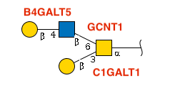
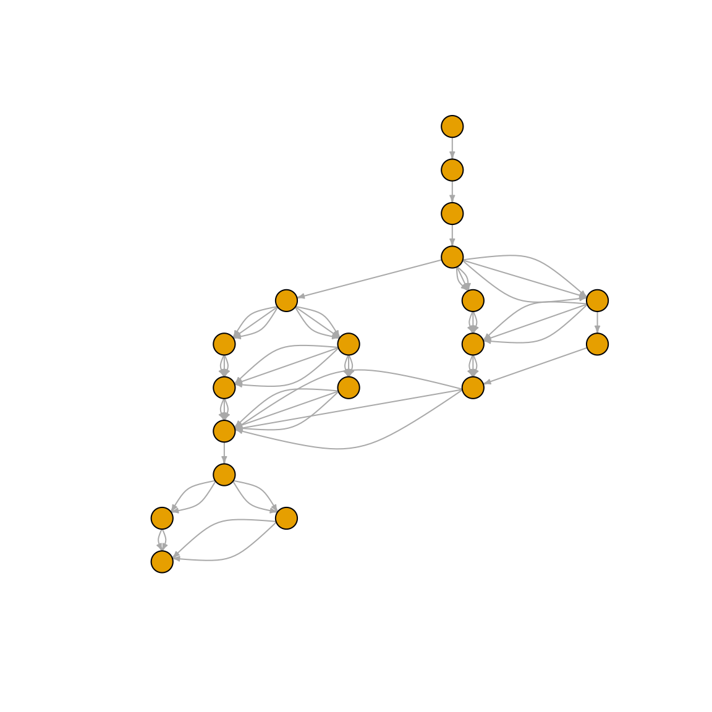

# Get Started with glyenzy

Glycan biosynthesis is built from many enzyme-specific reaction steps.
Glycosyltransferases and glycoside hydrolases each have their own
substrate preferences, linkage rules, and residue specificities, so a
glycan structure often carries useful clues about the enzymes that could
have produced it.

`glyenzy` provides tools for working with those enzyme rules in R. You
can use it to identify candidate enzymes for an existing glycan, trace
plausible biosynthetic paths, or predict products from enzyme-driven
reactions.

``` r

library(glyrepr)
library(glyenzy)
library(igraph)
#> 
#> Attaching package: 'igraph'
#> The following objects are masked from 'package:stats':
#> 
#>     decompose, spectrum
#> The following object is masked from 'package:base':
#> 
#>     union
```

**Quick heads-up:** `glyenzy` builds on `glyrepr`, `glyparse`, and
`glymotif`. You don’t need to master these packages to get started, but
they are useful when you want more control over glycan representation,
parsing, or motif matching. Also, this vignette assumes you’re
comfortable with IUPAC-condensed notation. If that notation is new to
you, start with [this
tutorial](https://glycoverse.github.io/glyrepr/articles/iupac.html).

## Your First Taste of Glycan Engineering

We’ll start with a small O-glycan example:



In the diagram, each glycosidic bond is labeled with its responsible
enzyme. (We’ll skip the rightmost peptide bond for now.)

Here is the same glycan in IUPAC-condensed notation:

``` r

glycan <- "Gal(b1-4)GlcNAc(b1-6)[Gal(b1-3)]GalNAc(a1-"
```

[`find_enzyme()`](https://glycoverse.github.io/glyenzy/dev/reference/find_enzyme.md)
returns the enzymes that may be involved in building a glycan:

``` r

find_enzyme(glycan)
#>  [1] "B4GALT1" "B4GALT2" "B4GALT3" "B4GALT4" "B4GALT5" "B4GALT6" "C1GALT1"
#>  [8] "GCNT1"   "GCNT3"   "GCNT4"   "GALNT1"  "GALNT2"  "GALNT3"  "GALNT4" 
#> [15] "GALNT5"  "GALNT6"  "GALNT7"  "GALNT8"  "GALNT9"  "GALNT10" "GALNT11"
#> [22] "GALNT12" "GALNT13" "GALNT14" "GALNT15" "GALNT16" "GALNT17" "GALNT18"
#> [29] "GALNT19"
```

This includes the enzymes shown in the diagram, along with B4GALT1/2/3/4
as additional candidates. We’ll return to why those enzymes appear
later.

You can also ask what products are formed when an enzyme acts on a
glycan. Here is ST3GAL1 applied to the same structure:

``` r

apply_enzyme(glycan, "ST3GAL1")
#> <glycan_structure[1]>
#> [1] Neu5Ac(a2-3)Gal(b1-3)[Gal(b1-4)GlcNAc(b1-6)]GalNAc(a1-
#> # Unique structures: 1
```

The function returns a
[`glyrepr::glycan_structure()`](https://glycoverse.github.io/glyrepr/reference/glycan_structure.html)
vector. In this case, a sialic acid is attached to the β1-3 Gal, while
the β1-4 Gal is not modified. That is because ST3GAL1 recognizes
“Gal(β1-3)GalNAc(α1-” as its substrate.

The next sections walk through the main workflows in a little more
detail.

## Tracing Glycan Origins

For an existing glycan, `glyenzy` can help answer four common questions:

- **Which enzymes?** Which glycosyltransferases and glycoside hydrolases
  were involved?
  ([`find_enzyme()`](https://glycoverse.github.io/glyenzy/dev/reference/find_enzyme.md))
- **How often?** How many times could each enzyme have acted?
  ([`count_enzyme()`](https://glycoverse.github.io/glyenzy/dev/reference/count_enzyme.md))
- **In what order?** What biosynthetic sequence could produce the
  structure?
  ([`trace_biosynthesis()`](https://glycoverse.github.io/glyenzy/dev/reference/trace_biosynthesis.md))
- **Specifically?** Which residues were added by which enzymes?
  ([`match_enzyme()`](https://glycoverse.github.io/glyenzy/dev/reference/match_enzyme.md))

Behind the scenes, glyenzy has catalogued the reaction rules of 138
enzymes in its enzyme database. Use `enzyme("MGAT3")` to inspect a
specific enzyme rule.

Combined with the sophisticated motif-matching algorithms from
`glymotif`, these rules can be used to reconstruct plausible
biosynthetic paths.

You’ve already seen
[`find_enzyme()`](https://glycoverse.github.io/glyenzy/dev/reference/find_enzyme.md),
which returns candidate enzymes. For more targeted checks:

- [`have_enzyme()`](https://glycoverse.github.io/glyenzy/dev/reference/have_enzyme.md)
  answers “Was enzyme X involved?” with a simple yes/no
- [`count_enzyme()`](https://glycoverse.github.io/glyenzy/dev/reference/count_enzyme.md)
  returns how many times an enzyme is inferred to act
- [`match_enzyme()`](https://glycoverse.github.io/glyenzy/dev/reference/match_enzyme.md)
  identifies the residues added by a specific enzyme

You will also find
[`view_enzyme()`](https://glycoverse.github.io/glyenzy/dev/reference/view_enzyme.md)
useful for visualizing the residues added by an enzyme on a glycan
cartoon.

These summaries can be useful in multiomics analysis, where glycan
structures are compared with enzyme expression levels.

[`trace_biosynthesis()`](https://glycoverse.github.io/glyenzy/dev/reference/trace_biosynthesis.md)
reconstructs a plausible biosynthetic path:

``` r

path <- trace_biosynthesis(glycan)
path
#> IGRAPH d6bff5a DN-- 4 10 -- 
#> + attr: name (v/c), enzyme (e/c), step (e/n)
#> + edges from d6bff5a (vertex names):
#> [1] GalNAc(a1-                       ->Gal(b1-3)GalNAc(a1-                       
#> [2] Gal(b1-3)GalNAc(a1-              ->Gal(b1-3)[GlcNAc(b1-6)]GalNAc(a1-         
#> [3] Gal(b1-3)GalNAc(a1-              ->Gal(b1-3)[GlcNAc(b1-6)]GalNAc(a1-         
#> [4] Gal(b1-3)GalNAc(a1-              ->Gal(b1-3)[GlcNAc(b1-6)]GalNAc(a1-         
#> [5] Gal(b1-3)[GlcNAc(b1-6)]GalNAc(a1-->Gal(b1-4)GlcNAc(b1-6)[Gal(b1-3)]GalNAc(a1-
#> [6] Gal(b1-3)[GlcNAc(b1-6)]GalNAc(a1-->Gal(b1-4)GlcNAc(b1-6)[Gal(b1-3)]GalNAc(a1-
#> [7] Gal(b1-3)[GlcNAc(b1-6)]GalNAc(a1-->Gal(b1-4)GlcNAc(b1-6)[Gal(b1-3)]GalNAc(a1-
#> + ... omitted several edges
```

The result is a directed `igraph` object. Each vertex represents a
glycan structure, and each edge represents an enzymatic step. If more
than one enzyme is involved in an enzymatic step, multiple edges are
created between the two vertices.

Here is the same workflow with a more complex N-glycan:

``` r

glycan <- "GlcNAc(b1-2)Man(a1-3)[Man(a1-6)]Man(b1-4)GlcNAc(b1-4)GlcNAc(b1-"
path <- trace_biosynthesis(glycan)
plot(
  path,
  layout = layout_as_tree(path),
  vertex.label = NA,
  vertex.size = 10,
  edge.arrow.size = 0.3,
  margin = 0
)
```



## Predicting Glycan Products

`glyenzy` can also predict products from a starting glycan and one or
more enzymes. We’ll start with a simple O-glycan core and then move to a
larger example.

``` r

# The GalNAc core of an O-glycan
glycan <- "GalNAc(a1-"
```

First, apply C1GALT1:

``` r

apply_enzyme(glycan, "C1GALT1")
#> <glycan_structure[1]>
#> [1] Gal(b1-3)GalNAc(a1-
#> # Unique structures: 1
```

This produces the Core 1 O-GalNAc glycan.

Here’s how
[`apply_enzyme()`](https://glycoverse.github.io/glyenzy/dev/reference/apply_enzyme.md)
works: give it a glycan and an enzyme, and it returns all possible
products. When multiple outcomes are possible, you’ll get them all
bundled in a
[`glyrepr::glycan_structure()`](https://glycoverse.github.io/glyrepr/reference/glycan_structure.html)
vector.

``` r

# A bi-antennary agalactosylated N-glycan
glycan <- "GlcNAc(b1-2)Man(a1-3)[GlcNAc(b1-2)Man(a1-6)]Man(b1-4)GlcNAc(b1-4)GlcNAc(b1-"
apply_enzyme(glycan, "B4GALT1")
#> <glycan_structure[2]>
#> [1] Gal(b1-4)GlcNAc(b1-2)Man(a1-3)[GlcNAc(b1-2)Man(a1-6)]Man(b1-4)GlcNAc(b1-4)GlcNAc(b1-
#> [2] Gal(b1-4)GlcNAc(b1-2)Man(a1-6)[GlcNAc(b1-2)Man(a1-3)]Man(b1-4)GlcNAc(b1-4)GlcNAc(b1-
#> # Unique structures: 2
```

Both antennae can be galactosylated, giving two distinct products. This
is a simple example of biochemical branching.

### Multi-Step Product Growth

For multi-step reactions, provide one or more starting glycans and a set
of enzymes. `glyenzy` will expand the products over successive reaction
steps.

Use
[`grow_glycans()`](https://glycoverse.github.io/glyenzy/dev/reference/grow_glycans_step.md)
for the full experience, or
[`grow_glycans_step()`](https://glycoverse.github.io/glyenzy/dev/reference/grow_glycans_step.md)
if you want one reaction step at a time:

``` r

# A bi-antennary N-glycan with three enzymes
grow_glycans(glycan, c("B4GALT1", "ST3GAL3", "MGAT3"))
#> ⠙ Step 4/5 | ■■■■■■■■■■■■■■■■■■■■■■■■■         80% | current number of glycans:…
#> ⠙ Step 5/5 | ■■■■■■■■■■■■■■■■■■■■■■■■■■■■■■■  100% | current number of glycans:…
#> <glycan_structure[32]>
#> [1] GlcNAc(b1-2)Man(a1-3)[GlcNAc(b1-2)Man(a1-6)]Man(b1-4)GlcNAc(b1-4)GlcNAc(b1-
#> [2] Gal(b1-4)GlcNAc(b1-2)Man(a1-3)[GlcNAc(b1-2)Man(a1-6)]Man(b1-4)GlcNAc(b1-4)GlcNAc(b1-
#> [3] Gal(b1-4)GlcNAc(b1-2)Man(a1-6)[GlcNAc(b1-2)Man(a1-3)]Man(b1-4)GlcNAc(b1-4)GlcNAc(b1-
#> [4] GlcNAc(b1-2)Man(a1-3)[GlcNAc(b1-4)][GlcNAc(b1-2)Man(a1-6)]Man(b1-4)GlcNAc(b1-4)GlcNAc(b1-
#> [5] Gal(b1-4)GlcNAc(b1-2)Man(a1-3)[Gal(b1-4)GlcNAc(b1-2)Man(a1-6)]Man(b1-4)GlcNAc(b1-4)GlcNAc(b1-
#> [6] Gal(b1-4)GlcNAc(b1-2)Man(a1-3)[GlcNAc(b1-4)][GlcNAc(b1-2)Man(a1-6)]Man(b1-4)GlcNAc(b1-4)GlcNAc(b1-
#> [7] GlcNAc(b1-2)Man(a1-3)[Gal(b1-4)GlcNAc(b1-4)][GlcNAc(b1-2)Man(a1-6)]Man(b1-4)GlcNAc(b1-4)GlcNAc(b1-
#> [8] Gal(b1-4)GlcNAc(b1-2)Man(a1-6)[GlcNAc(b1-2)Man(a1-3)][GlcNAc(b1-4)]Man(b1-4)GlcNAc(b1-4)GlcNAc(b1-
#> [9] Neu5Ac(a2-3)Gal(b1-4)GlcNAc(b1-2)Man(a1-3)[GlcNAc(b1-2)Man(a1-6)]Man(b1-4)GlcNAc(b1-4)GlcNAc(b1-
#> [10] Neu5Ac(a2-3)Gal(b1-4)GlcNAc(b1-2)Man(a1-6)[GlcNAc(b1-2)Man(a1-3)]Man(b1-4)GlcNAc(b1-4)GlcNAc(b1-
#> ... (22 more not shown)
#> # Unique structures: 32
```

In this example, each enzyme contributes a different reaction:

- **B4GALT1**: Adds β1-4 Gal to GlcNAc branches
- **ST3GAL3**: Adds α2-3 sialic acid
- **MGAT3**: Adds a bisecting GlcNAc to the core mannose

The result is a collection of 32 different glycans, including the
original starting structure.

## The Fine Print

Here are the main caveats to keep in mind when using `glyenzy`:

### Species and Scope

glyenzy is currently a human-centric package, focusing specifically on
N-glycans and O-glycans. If you’re working with GAGs, glycolipids, or
glycans from mouse, plants or insects, the results might not be
accurate.

### Inclusive Candidate Calls

Our algorithms are intentionally inclusive – they assume that *all*
possible isoenzymes capable of catalyzing a reaction might be involved.
This means you should interpret results with a grain of salt.

For instance, when glyenzy spots the motif “Neu5Ac(α2-3)Gal(β1-”, it’ll
flag both ST3GAL3 and ST3GAL4 as potential culprits. In reality, tissue
specificity and other factors might mean only one is actually active.
Treat the output as a list of plausible candidates rather than a
definitive assignment.

### Concrete Residues Only

glyenzy requires precise residues – it only works with **concrete**
residues like “Glc” and “GalNAc”, not **generic** ones like “Hex” or
“HexNAc”. If your data uses generic terms, you’ll need to resolve them
before using these functions.

### Substituents: Not Yet Supported

Modifications like sulfation and phosphorylation aren’t supported yet,
and they might actually break the algorithms. If your glycans are
decorated with these extras, use
[`glyrepr::remove_substituents()`](https://glycoverse.github.io/glyrepr/reference/remove_substituents.html)
to get clean, analysis-ready structures.

### Complete Structures Required

Incomplete or partially degraded glycan structures can lead glyenzy
astray. Make sure your input represents the full, intact glycan for
reliable results.

### Biosynthetic Starting Points

glyenzy uses specific starting points for biosynthetic reconstruction:

- **N-glycans**: Begin with the Glc₃Man₉GlcNAc₂ precursor (post-OST
  transfer)
- **O-GalNAc glycans**: Start with GalNAc(α1-
- **O-GlcNAc glycans**: Start with GlcNAc(b1-
- **O-Man glycans**: Start with Man(a1-
- **O-Fuc glycans**: Start with Fuc(a1-
- **O-Glc glycans**: Start with Glc(b1-

This means we don’t track the earlier steps – ALGs building the N-glycan
precursor, OST transferring it to asparagine, or GALNTs adding the
initial GalNAc. The reconstruction starts after those events.

## Technical Notes

`glyenzy` relies on a few related glycoverse packages:

- **`glyrepr`**: The foundation for representing glycan structures
- **`glyparse`**: The parser for IUPAC-condensed notation
- **`glymotif`**: The motif-matching engine for structural patterns

All enzymes live as
[`enzyme()`](https://glycoverse.github.io/glyenzy/dev/reference/enzyme.md)
objects (technically `glyenzy_enzyme` S3 class instances). Call
`enzyme("YOUR_FAVORITE_ENZYME")` to inspect a specific enzyme rule.
